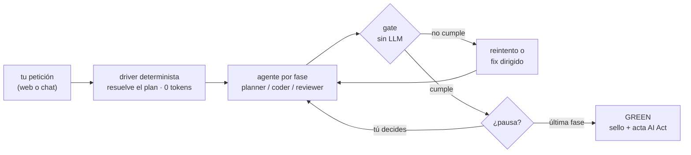

<div align="center">

# conductor

**Spec-Driven Development verificado**

*Un driver determinista conduce a la IA fase a fase, y un gate sin LLM comprueba que lo construido
cumple lo especificado — antes de dar nada por hecho.*

`v2.0.0` · `Node ≥ 20` · `0 dependencias` · `instalación única por npm` · `100% local`

</div>

---

## 📋 Requisitos

| Necesitas | Obligatorio | Para qué | Si falta |
|---|:---:|---|---|
| **Node.js ≥ 20** | ✅ | el motor y la miniweb (cero dependencias npm) | nada arranca |
| **git de línea de comandos** | ✅ | instalar desde el repo (`npm i -g git+…` usa git por debajo) y las integraciones **solo-lectura** de la miniweb: la sección «Cambios» del run (diff), el sello `git_tree` y el guardrail de árbol limpio | la app funciona y el chip de rama sigue (lee `.git/HEAD` directamente), pero sin diffs ni sello |
| **GitHub Copilot CLI** con licencia activa | ✅ | el ejecutor de TODAS las fases, el catálogo vivo de modelos y los tokens/AI credits reales (salen del recibo de cierre de cada sesión) | no hay runs — los CLIs de chat (Copilot, Claude Code, OpenCode, VS Code) son vías opcionales al mismo motor |
| key de tu proxy LiteLLM | ⚪ opcional | modelos propios a **0 créditos premium** | solo modelos del catálogo Copilot |
| **GitHub CLI** | ⚪ opcional | ver las métricas de AI credits en la web | todo lo demás funciona igual |

> [!TIP]
> En equipos gestionados, git y GitHub CLI están disponibles en el **Portal de empresa**.

---

## Índice

**[¿Qué es?](#-qué-es)** · **[Instalación](#-instalación-una-vez-por-máquina)** · **[Por proyecto](#-por-proyecto-una-vez-por-repo)** · **[Uso diario](#-uso-diario--dos-vías-mismo-motor)** · **[Modelos y coste](#-modelos-y-coste)** · **[Por qué fiarte](#-por-qué-fiarte-calidad-y-seguridad)** · **[Arquitectura](#%EF%B8%8F-arquitectura-cómo-funciona-por-dentro)** · **[Comandos](#-comandos-de-referencia)** · **[¿Algo no va?](#-algo-no-va)**

---

## 🎯 ¿Qué es?

conductor convierte "pedirle código a la IA" en un **proceso de ingeniería auditable**: primero la spec, luego el código contra ella, y al final un **gate determinista** (código, no un modelo) verifica coherencia spec ↔ código ↔ tests. Si no cumple, no hay GREEN — da igual lo convincente que suene el modelo.

| Sin conductor | Con conductor |
|---|---|
| La IA genera código al vuelo | **Spec primero**; el código se implementa contra ella |
| "Hecho" = "el modelo dice que está hecho" | **Gate sin LLM** verifica coherencia y trazabilidad requisito→código→test; sin NINGÚN test = **aviso visible** (y **bloquea** en presets estrictos). Un test sin etiqueta que ejercita el código **cuenta** (cobertura por referencia) |
| Un modelo flojo se salta pasos | La secuencia la garantiza **código**: con cualquier modelo, las fases van en orden o no avanzan |
| Un solo modelo para todo | **Modelo por FASE**, mezclando proveedores en el mismo run: planifica barato con tu proxy, codea con tu licencia premium |
| El consumo es una caja negra | **Tokens y coste por fase**, estimación ANTES de lanzar (sin gastar API) y precisión del estimador medida |
| Sin evidencia | Cada GREEN queda **sellado (Ed25519)**, encadenado a un **ledger** y con **informe AI Act** (modelos, aprobaciones humanas con hash de lo aprobado, verificación) |

> [!IMPORTANT]
> **Tú mandas**: el pipeline pausa para tu revisión, y en cada pausa puedes editar la spec, dar instrucciones, cambiar el modelo en caliente, rehacer una fase o parar. Nada de piloto automático.

---

## 📦 Instalación (una vez por máquina)

```bash
# 1. Instalar
npm i -g "git+<url-del-repo>#<rama-o-tag>"

# 2. Comprobar
conductor version          # → conductor 2.0.0

# 3. Conectar tus CLIs de chat (menú interactivo; Enter = los detectados)
conductor setup
```

`setup` conecta el comando **`/conductor`** y el servidor MCP en los CLIs que tengas (Copilot, Claude Code, OpenCode) y deja creada la **plantilla de credenciales**.

<details>
<summary><b>Credenciales del proxy LiteLLM</b> (opcional, recomendado — modelos a 0 créditos premium)</summary>

<br>

Abre `~/.conductor/litellm.json` — la plantilla te enseña el formato:

```json
{
  "baseUrl": "https://tu-proxy/v1",
  "apiKey": "sk-…",
  "models": {
    "mi-modelo": { "name": "Mi Modelo", "limit": { "context": 128000, "output": 16384 } }
  }
}
```

- Los `models` que declares salen **siempre** en el selector, con su nombre y sus límites.
- **También puedes pegar tu bloque de proveedor de OpenCode tal cual** (con `options.baseURL`, timeouts…) — conductor lo entiende.
- La key **se queda como tú la escribas** (mismo hábito que tu `opencode.json`). ¿Prefieres cifrarla? Añade `"seal": true` (AES-256-GCM) o usa `conductor litellm login`. En cualquier caso jamás viaja por HTTP ni la ve un modelo, y `conductor litellm status` te enseña su huella (últimos 4 + sha corto) para que SIEMPRE sepas cuál hay dentro.

</details>

---

## 🗂 Por proyecto (una vez por repo)

```bash
cd tu-proyecto
conductor init
```

`init` **detecta tu repo** (determinista, 0 tokens) y te lo enseña: versiones exactas, gestor de paquetes, proyectos del workspace y los **comandos reales** de build/test/lint — que quedan **ya sembrados como `checks`** en conductor.json (la fase test los ejecuta). Crea el árbol **OpenSpec** completo:

```
openspec/
├── project.md            ← CONTEXTO (con el bloque «detectado» que cada init refresca; el resto es tuyo)
├── conductor.json        gobierno del equipo — nace con TUS checks detectados; todo lo demás es opcional
├── specs/                fuente de verdad VIVA (la llena el ciclo al archivar)
└── changes/  + archive/  cambios activos e histórico
```

Si el repo ya tiene **AGENTS.md / copilot-instructions**, init lo detecta y el project.md los **referencia** en vez de repetirlos (cero duplicidad: cada dato, una casa). Para el relleno semántico leyendo tu repo con IA: `conductor init-config . --smart`. `init` también ofrece (mini-menú) el comando `/conductor` **por-proyecto** para cada CLI — ficheros committeables: al clonar el repo, todo tu equipo lo hereda.

---

## 🚀 Uso diario — dos vías, mismo motor

### 🌐 La miniweb (el cockpit)

```bash
conductor        # abre la PÁGINA DE TU PROYECTO (http://127.0.0.1:4750/<proyecto>) — la arranca si está apagada
```

La jerarquía es **home global → proyecto → run**: `/` es el panel global (tus proyectos clicables, lo vivo y lo pendiente de todos, métricas e historial agregados) y cada proyecto tiene su URL declarativa (`/<proyecto>`, navegable y compartible) con su formulario de lanzar. Te mueves entre proyectos con un clic (tarjetas de la home o cabeceras de la sidebar) — o con `conductor` desde cualquier repo.

1. **Describe la feature** en el formulario de tu proyecto (`@fichero` para dar contexto, `/skill` para patrones de equipo, arrastra capturas).
2. Revisa el **plan**: preset propuesto, fases, y la **estimación de tokens sin gastar API**.
3. Elige **modelo por fase** si quieres mezcla — y 💾 para guardarla como default del equipo.
4. **Lanza** y decide en cada pausa: 📄 artefactos (✏️ editables) · **± vs spec viva** (diff del delta contra la spec promovida) · 📣 nota para la fase · 🎛 modelo en caliente · ↺ rehacer · ✓ aprobar · ■ detener.
5. Si el gate encuentra fallos: eliges cuáles van al **fix dirigido** y se re-verifica.
6. En GREEN: 📋 descripción de PR · 📊 informe · 🛡 AI Act · 📃 sesión completa del agente · ⬆ **Archivar** (promueve las specs a la fuente de verdad).

La app es única y local (127.0.0.1, solo tú), instalable como PWA, se apaga sola tras 120 min sin uso (`conductor stop` para pararla ya) y **jamás finge**: si el servidor no está, lo dice.

### 💬 El chat (sin salir de tu CLI)

```
/conductor añade un endpoint de salud con sus tests   ← pipeline con pausas EN el chat
/conductor                                            ← estado y ayuda, sin abrir navegador
```

> [!NOTE]
> **El modelo del chat no viaja al run**: las fases usan lo que diga `openspec/conductor.json` (o el modelo de sesión de Copilot si no fijaste nada) — el banner de arranque declara cuáles. Si quieres uno concreto (por ejemplo el mismo de tu chat), dilo en el mensaje («usa litellm:mi-modelo») y el agente lo pasa al run entero.

Las pausas te llegan como conversación **legible**: el motor construye la presentación (fase, progreso, decisiones previas, hallazgos y la spec en titulares — jamás el muro GIVEN/WHEN/THEN) y el chat la imprime tal cual. Web y chat se coordinan: si apruebas en la web, cualquier mensaje tuyo re-engancha el chat con lo decidido, y una aprobación tardía **jamás** cae en una pausa que no viste. En VS Code, la primera vez el chat pedirá permiso por cada tool: elige **«Always allow»**. Para procesos/CI existe además el modo job: la tool MCP `conductor_drive {async:true}` lanza y devuelve el identificador al instante.

---

## 🎛 Modelos y coste

- Prefijos: `litellm:<modelo>` (tu proxy, **0 créditos premium**) · `copilot:<modelo>` (catálogo real de tu licencia) · sin prefijo = el de la sesión.
- **Catálogo 100% vivo**: la lista de Copilot sale del SDK del CLI auto-actualizado — TODOS los modelos de TU licencia, con su nombre oficial, ventana de contexto y **categoría de AI credits** (la misma del picker oficial). Si mañana cambian los modelos, la lista cambia sola.
- **Mezcla libre en el mismo run**: cada fase con su modelo. La fase gana al rol (`models.spec` > `models.planner`) — en la web, «Por fase (avanzado)». Regla práctica: `spec` y `verify` con el más capaz (un error de spec se propaga a todo; verify decide el GREEN), `explore`/`tasks` con el económico, `apply` en el medio con `fallback`.
- **`fallback` (opt-in)**: modelo de reserva por rol/fase — si el primario falla por timeout/proveedor, UN intento extra con la reserva, registrado con total transparencia (timeline, AI Act, badge 🛟).
- **Frenos reales**: `budget` (techo duro de tokens/coste por run) · `tiers` (economy/balanced/premium — el tier de cada modelo Copilot sale de su categoría de precio REAL, no de una tabla) · timeout y reintentos acotados por fase.
- **Verificable**: `conductor stats` muestra consumo real por proveedor/modelo, el ahorro, la **precisión del estimador** (estimado vs real medido) y un corte **POR DÍA** (día × modelo × proveedor: peticiones y tokens) — cruzable 1:1 con el informe de consumo de tu organización: allí ves el €, aquí en qué se fue.

```json
// openspec/conductor.json — ejemplo mínimo (TODO es opcional)
{
  "models": { "planner": "litellm:mi-modelo-barato", "coder": "copilot:claude-sonnet-4.5" },
  "preset": "feature",
  "fallback": { "coder": "copilot:claude-haiku-4.5" }
}
```

Presets (el dial de gobierno): `quick-fix` · `visual` (laxos: un typo no exige test nuevo) · `feature` (default: trazabilidad estricta) · `migration` (además: clarify obligatorio, spec congelada, gate de datos SQL). `verify` está SIEMPRE — es innegociable. Y las **lentes de review van por riesgo**: quick-fix/visual pasan 1 lente, feature 3, migración 4 — un typo no paga tres revisores.

---

## 🛡 Por qué fiarte (calidad y seguridad)

- **Gate determinista sin LLM**: coherencia, estructura, trazabilidad, tests que verifican de verdad (caza tests "huecos"), secretos hardcodeados, SQL destructivo, breaking-changes de contrato. No obedece prompts: o cumple, o FAIL.
- **El propio harness se auto-certifica**: un golden-set de 12 escenarios (`conductor evals`, offline, 0 tokens) ejercita cada gate e invariante con su resultado esperado; el pass-rate queda **versionado en git**, y cambiar un prompt del pipeline **exige** re-certificar en verde.
- **Provenance**: sello Ed25519 por GREEN **atado al árbol git exacto** del working tree («verificado» = ESTE código, no la fe) + ledger hash-encadenado (manipular una entrada rompe la cadena) + `conductor upgrade` que reinstala de tu origen y **verifica el motor nuevo** antes de dártelo por bueno.
- **Agentes con correa corta**: sin git, sin red, sin comandos destructivos; toolset mínimo por rol; el contenido del repo se trata como **datos**, no como instrucciones; ejecutar los tests del proyecto requiere TU consentimiento explícito.
- **AI Act**: el acta de «quién hizo qué» por cambio (modelo y **papel** de cada agente por fase, aprobaciones humanas **con hash de lo aprobado**, verificación, sello) — la evidencia que exige la UE desde el 2-ago-2026, como subproducto gratis del pipeline. **No es el sello de calidad** (eso es GREEN, el veredicto SDD): es la respuesta preparada si un cliente o auditoría pregunta por la IA. Cuándo aplica y cuándo no: en la Ayuda del panel.

---

## ⚙️ Arquitectura: cómo funciona por dentro

### El flujo de un run (el modelo mental)



Tu petición entra (web o chat) → el **driver determinista** (código, no un modelo) resuelve el plan de fases según complejidad y preset → lanza **un agente por fase** con su papel, su modelo y su toolset recortado → cada artefacto pasa el **gate sin LLM** → tú decides en las pausas → en GREEN, el run queda **sellado** y su evidencia archivada. Si algo no cumple, no avanza — da igual lo convincente que suene el modelo.

### Quién decide el plan (y por qué sin LLM)

La complejidad y las fases las resuelve **código puro** (`resolvePlan`), 0 tokens: señales de contenido en tu petición — «sustancial» (varias capacidades, arquitectura, integración, migración, refactor amplio) y «ambiguo» (corta o con preguntas abiertas). Sustancial → medium; sustancial+ambiguo → complex; resto → simple. ¿Puede equivocarse una heurística de texto? Sí — y está diseñada para que **el fallo sea barato y visible**: equivocarse solo cambia cuántas fases previas corren (apply + verify + gates están SIEMPRE, no son negociables), el plan se enseña **antes** de ejecutar (banner en el chat, fases en la web) y lo corriges en un clic (checkboxes de fases, preset, o pidiéndolo en la petición). La alternativa — un LLM clasificador — cuesta tokens, no es reproducible y convierte al portero en otro agente que puede alucinar. Aquí dos peticiones iguales dan siempre el mismo plan, y eso es testeable (el golden-set lo certifica).

### El contexto entre fases (por qué sesiones separadas no pierden memoria)

Cada fase corre en su **propia sesión efímera** que muere al terminar — y el contexto **no** viaja por la memoria del chat: viaja por **artefactos en disco**. La columna vertebral son los ficheros SDD (`proposal.md` → `spec.md` → `design.md`/`tasks.md` → código → `verify-report.md`) y el driver inyecta además, fase a fase, lo que esa fase necesita: el **mapa de código** (imports/exports/usedBy — el modelo no re-descubre dependencias leyendo ficheros), el **stack detectado** del proyecto, tus **notas de las pausas** y los **hallazgos de los gates** en los reintentos. Ventajas frente a una sesión larga: sin contaminación entre papeles (el reviewer no hereda los sesgos del coder), coste acotado (no arrastras la historia entera en cada turno) y contexto **auditable** — está en ficheros que puedes leer, no en una conversación que se esfumó.

### Las piezas

- **Motor** (`engine/`): JavaScript puro (ESM), Node ≥ 20, **cero dependencias de npm**. Contiene el driver del pipeline, los gates, el servidor web local, el servidor MCP y el CLI.
- **Miniweb** (`ui/`): la única parte TypeScript — componentes **Lit** (web components estándar) compilados con **Vite**. Instalable como **PWA**, con Service Worker.
- **Empaquetado**: la UI la compila Vite a `assets/ui/`; el motor lo concatena un **bundler propio** (`node engine/build.mjs`, también 0 deps) en un único fichero — `assets/conductor.mjs` — que es exactamente lo que instala `npm i -g`. Sin `node_modules` en producción: menos superficie, arranque instantáneo, auditoría de un solo fichero.

### Cómo ejecuta a los agentes

- Cada fase corre como una **sesión del CLI de GitHub Copilot** — por proceso (`spawn`) o por su **SDK** oficial (`runner: "sdk"`). Del SDK salen además el **catálogo vivo de modelos** (nombres oficiales, ventana de contexto, categoría de AI credits) y los **tokens reales** por sesión.
- **El SDK no se instala nunca** (ni conductor ni cada run): viene **dentro** del paquete `@github/copilot` que ya tienes instalado con tu CLI de Copilot. Conductor lo localiza (`npm root -g`) y lo carga con un **import dinámico** — una vez por proceso, milisegundos, y Node lo cachea. Por eso el motor sigue a 0 dependencias, no hay nada que actualizar por separado (el catálogo se renueva solo cuando tú actualizas tu CLI) y si el SDK no está, hay fallback automático al modo proceso.
- Los modelos de tu **proxy LiteLLM** entran por la vía BYOK (0 créditos premium) — mezclables por fase en el mismo run.
- **Papeles**: `planner` (planifica y especifica — no toca código) · `coder` (el único con escritura en el proyecto, fases apply/fix) · `reviewer` (verify, con **lentes en paralelo cuyo número marca el riesgo del preset**). La orquestación jamás es un LLM: por eso dos runs con las mismas entradas se comportan igual.
- **Correa por fase**: toolset recortado (`--excluded-tools` en fases que no codean), reviewer sin escritura, sin git ni comandos destructivos, y ejecutar tus tests reales exige tu consentimiento explícito (`checks` + toggle test).

### Con qué se integra

- **MCP en dos direcciones**: conductor **es** un servidor MCP — así conducen el pipeline Copilot CLI, VS Code, OpenCode y Claude Code. Y los agentes de fase **pueden consumir** servidores MCP de terceros si el equipo los configura (opt-in con guardas).
- **Cómo sabe tu CLI que conductor «habla MCP»**: no hay registro central ni instalación aparte — `conductor setup` escribe UNA entrada en la config de tu host (`{"mcpServers": {"conductor": {"command": "conductor", "args": ["mcp"]}}}`) que significa «lanza este comando como proceso hijo y háblale el protocolo MCP». Al abrir el chat, el host lo arranca y hacen el saludo del protocolo: `initialize` (nombre, versión, capacidades) → `tools/list` (las tools con sus schemas). Eso es «**JSON-RPC por stdio**»: mensajes JSON con id de petición/respuesta, por la entrada/salida estándar del proceso — sin red, sin puertos, sin credenciales.
- **git, solo en modo lectura**: checkpoints por fase y baseline de cambios con **índice propio** (`git write-tree` con `GIT_INDEX_FILE`) — cero impacto en tu HEAD, rama o staging. El sello registra el árbol exacto verificado. **Conductor jamás commitea**: eso es tuyo.
- **GitHub CLI** (opcional) para tus AI credits; **tu proxy LiteLLM** (`/key/info`, endpoint estándar de LiteLLM: gasto real y presupuesto de TU key según el proxy — no una estimación) para el dinero. Los tokens por fase salen del **recibo de cierre de cada sesión** (`session.shutdown`); la lectura por **OTel** es la vía **legacy** (CLIs de Copilot antiguos que ya no lo emiten) y solo queda como fallback para runs viejos.

### Las 17 tools MCP (la superficie completa)

| Grupo | Tools | Qué hacen |
|---|---|---|
| Cockpit del chat | `conductor_feature` · `conductor_continue` | lanzar el pipeline y responder sus pausas EN la conversación (modelo heredable del chat) |
| App y entregables | `conductor_app` · `conductor_receipt` · `conductor_drive` | abrir/consultar el panel · recibo de PR del run verificado · pipeline entero en una llamada (CI/jobs, con modo async) |
| Gates y análisis | `conductor_gate` · `conductor_contract` · `conductor_trace` · `conductor_cost` · `conductor_explain` · `conductor_drift` | el gate determinista a demanda · contrato de API · traza requisito→código→test · coste · explicación de un run · deriva spec↔código |
| Evidencia | `conductor_seal` · `conductor_verify` | sellar (SHA-256 + Ed25519/HMAC) y verificar la evidencia |
| Migración/legacy | `conductor_migrate` · `conductor_legacy` | lint de migraciones SQL · evidence-gate de código legado |
| Utilidades | `conductor_init_config` · `echo` | generar config inicial · diagnóstico del puente |

### Dónde vive cada cosa (y por qué)

```
openspec/                          COMMITTEABLE — tu equipo lo hereda al clonar
  project.md                       contexto del proyecto: tu parte + bloque auto-detectado (stack real)
  conductor.json                   gobierno: modelos por rol/fase, preset, checks, fallback, budget
  specs/<dominio>/spec.md          la spec VIVA — fuente de verdad de lo que el sistema HACE
  changes/<run>/                   un run = un change: proposal.md · specs/ (delta) · design.md ·
                                   tasks.md · apply-report.md · verify-report.md
  changes/archive/                 runs archivados (histórico navegable)
  provenance.ledger.jsonl          ledger de sellos — committeable A PROPÓSITO (historial verificable del equipo)

.conductor/                        ESTADO DE MÁQUINA — ignorado por git
  runs/<change>/                   evidencia: timeline.json (fases/modelos/tokens/veredicto) ·
                                   log.txt · events.jsonl (traza de sesión) · dashboard.html · sello
  launcher.log                     arranques de la app local

.github/skills/conductor/SKILL.md  el /conductor de Copilot CLI y VS Code (committeable)
.claude/  .opencode/               el mismo /conductor para Claude Code y OpenCode
.vscode/mcp.json                   puente MCP del chat de VS Code
~/.conductor/                      TU MÁQUINA (no el repo): credenciales LiteLLM, registro de proyectos, caches
```

- `openspec/` — **committeable**: specs (fuente de verdad), changes, gobierno del equipo (`conductor.json`), contexto (`project.md`), ledger de verificaciones. Tu equipo lo hereda al clonar.
- `.conductor/` en la raíz del proyecto — **estado de máquina** (ignorado por git): evidencia de runs, timeline, log, crudo del modelo, sello. La miniweb lee de aquí; los prompts, jamás.
- Regla de deduplicación: **cada dato, una casa** — lo derivable se re-detecta vivo en cada run (stack, codemap, catálogo) en vez de versionarse y pudrirse; si ya tienes `AGENTS.md`/`copilot-instructions`, el contexto los referencia en vez de repetirlos. (¿Quieres usar además el CLI oficial de OpenSpec? Crea `openspec/config.yaml` con `schema: spec-driven` — conductor no lo necesita, y ojo: el `archive` de ese CLI no mueve nuestra evidencia; archiva siempre con conductor.)

### La calidad del propio motor

Suite de **más de 600 tests** (gates, driver, servidor, MCP, CLI), un **golden-set** de escenarios extremo-a-extremo offline (`conductor evals`, 0 tokens) cuyo pass-rate queda versionado, y un **gate de prompts**: cambiar un prompt del pipeline exige re-certificar en verde. Criptografía de la evidencia con `node:crypto` (SHA-256, HMAC, **Ed25519**); config validada con **JSON Schema** (draft-07); estructura de specs conforme al estándar **OpenSpec** (el CLI oficial reconoce los repos).

El detalle completo y auditado (harness, primitivas, contratos internos) vive en **AGENTS.md**.

---

## 📖 Comandos de referencia

| Diario | |
|---|---|
| `conductor` | abre la miniweb en este repo (la arranca si está apagada) |
| `conductor setup` | **imprescindible una vez por máquina** tras instalar: conecta tus CLIs de chat y crea la plantilla de credenciales |
| `conductor init` | inicializa el proyecto (una vez por repo) |
| `/conductor <petición>` | el pipeline en el chat de tu CLI |
| `conductor stats` | consumo real, ahorro y precisión del estimador |
| `conductor doctor` | autotest del entorno (credenciales, prompts, hosts, app) |
| `conductor receipt <change>` | descripción de PR del run verificado |

| Cuando lo necesites | |
|---|---|
| `conductor setup` (de nuevo) | re-conectar un CLI nuevo o regenerar la plantilla de credenciales |
| `conductor init-config . --smart` | relleno semántico de project.md/checks/rules leyendo TU repo (un one-shot de agente) |
| `conductor litellm status` | estado de tus credenciales del proxy |
| `conductor evals` | golden-set del harness (offline, 0 tokens) |
| `conductor upgrade` | actualizar desde tu origen + verificación del motor nuevo |
| `conductor stop` / `restart` | ciclo de vida de la app (se niega a parar con runs vivos) |
| `conductor help --all` | la sala de máquinas completa (gates, sellos, ledger, CI…) |

---

## 🩺 ¿Algo no va?

1. `conductor doctor` — te dice qué falta y cómo arreglarlo (credenciales, hosts, proxy corporativo, bundle).
2. `http://127.0.0.1:4750/demo` — un run de muestra completo sin gastar un token.
3. La pantalla «conductor está apagado» no es un error: es la app siendo honesta; arráncala con `conductor`.
4. Credenciales: el panel muestra el MOTIVO exacto (plantilla sin rellenar, key rechazada por el proxy…) — nunca inventa modelos.
5. Log de arranque: `.conductor/launcher.log` en tu proyecto.
